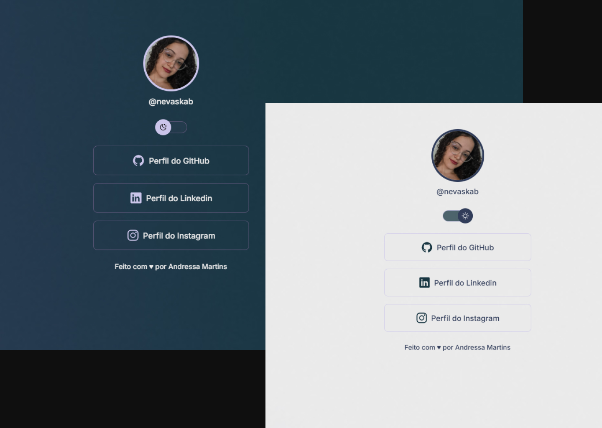

<h1 align="center">Profile Links</h1>

### 💻 Projeto

O presente projeto visa desenvolver habilidades técnicas em tecnologias WEB tendo como base o programa gratuito promovido pela Rockseat.

  

### 🚀 Tecnologias
  Esse projeto foi desenvolvido com as seguintes tecnologias:

  - HTML e CSS
  - Javascript
  - Git e Github
  - Figma

### 🌐 Acesso 

<a href="https://profile-links-rho.vercel.app">Profile Links by Andressa Martins</a>

### Autor

<a>
 
<b>Andressa Martins</b></a>

Feito por Andressa Martins. Entre em contato <3.

